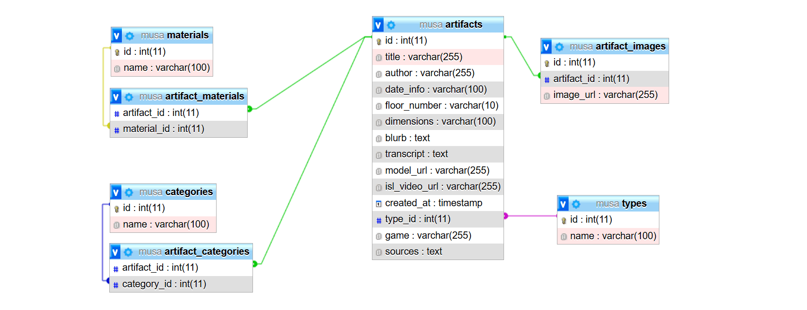

# MUSA

**MUSA** is a mobile-first museum website designed for deaf users who communicate using Irish Sign Language (ISL). The web-app features ISL interpretation videos for artifacts, interactive 3D renderings for closer exploration, and puzzle games or quizzes to support engagement and information retention.

This group project is part of the **"Research Project" module (CS7043)** of the **MSc in Interactive Digital Media** at **Trinity College Dublin**.

## Table of Contents

1. [Features](#features)
2. [Technologies](#technologies)
3. [Roles](#roles)
4. [Getting started](#getting-started)
    - [Installation prerequisites](#installation-prerequisites)
    - [Installation steps](#installation-steps)
    - [.env.example](#envexample)
5. [Code organisation](#code-organisation)
---

## Features 
- **ISL videos**: interpreted videos offering clear, engaging artwork descriptions and stories.
- **Interactive 3D artifacts**: explore each artwork in-depth with interactive 3D models.
- **Games**: interactive games that reinforce learning and enhance the experience for Deaf visitors.
- **QR code scanning**: scan QR codes to access specific artifacts.
- **Search and filter for artifacts**: search bar and filter system help users quickly find artifacts based on category, type, and floor.
- **Downloadable certificate of achievement**: pdf certificate is available for download if the user scores 80% or more in the quiz game.
  
---

## Technologies
- **Frontend**:  
  - HTML5, EJS, CSS3, JavaScript;
  - [Bootstrap](https://getbootstrap.com/) for responsive design;

- **Backend**:  
  - [Node.js](https://nodejs.org/) for the server-side;
  - [Express.js](https://expressjs.com/) for building the APIs;
  - [MySQL (managed via phpMyAdmin)](http://localhost/MAMP/) for the relational database.

- **Database structure**:

  

---

## Roles 
- Lucy Jacobson: UI/UX Designer & Marketing materials
- Kiera O'Hara: Content Creator & Partnerships
- Robyn Quigley: Project Manager & Video editor
- Xinkai Ge: 3D Modeler & Contributed to Quiz game and Catching game
- Nithya Samadhi Lokuge: Full-stack Developer - Frontend, Database structure, Backend
  
---

## Getting Started

### Installation prerequisites 
**Before running **MUSA**, ensure you have the following installed:**  
- [Node.js](https://nodejs.org/) (for running the backend)
- [MAMP](https://www.mamp.info/en/downloads/) (for setting up MySQL locally)

### Installation steps
**1. Start the MAMP servers**:
- Open the MAMP application.
- Click "Start Servers" to launch MySQL.
  
    - *If the servers fail to start*:
      - Click "MAMP" in the top menu bar of the MAMP application.
      - Go to "Preferences" → "Ports".
      - Set Apache Port to 80 and MySQL Port to 3306 (these are the default values).
      - Click OK and try starting the servers again.
        
**2. Download the repository**.

**3. Install all dependencies**: 
```bash
npm i
```
**4. Set environment variables**: update the `.env` file in the root directory and populate it with the necessary values. You can refer to the [`.env.example`](#envexample) file for guidance.

**5. Tables won't be created for you:**

Using the MySQL phpAdmin dashboard, click on `Import` and upload the `musa.sql` file provided in the `docs` folder. In this way, all tables and their data will be automatically uploaded.

**6. Run the project**: 
```bash
npm start
```

**7. Visit** http://localhost:PORT **and explore MUSA**: 

*Note*: Instead of PORT, insert the PORT number you specified in the `.env` file.

### .env.example

```env
# MAMP MySQL configuration
DB_HOST = localhost          # Default for MAMP
DB_USER = root               # Default for MAMP
DB_PASSWORD = root           # Default for MAMP
DB_NAME = musa            
DB_PORT = 3306               # Default MySQL port

# Server port (Change if needed)
PORT = 5500
```
---

## Code organisation

- `config`: contains the database setup file.
- `controllers`: store the controller that handles the application's logic for searching, filtering artifacts and viewing their details.
- `docs`: contains the `musa.sql` dump and a screeshot of the database structure.
- `models`: contains the database model that defines the structure of the application's data.
- `public`: stores files such as CSS, images, and JavaScript.
- `routes`: defines the application's routes.
- `utils`: contains the file that checks if the model_url is valid.
- `views`: contains the files that define the UI of the application. It uses the EJS template engine for dynamic content rendering.
    - `hunt`: stores views of The Hunt Museum.
        - `games`: stores views of The Hunt Museum's games.
    - `partials`: contains reusable view components such as headers, modals, and the footer.
- `index.js`: this file is the entry point of the application. It initialises the server and sets up routes.
